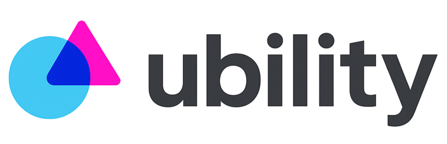
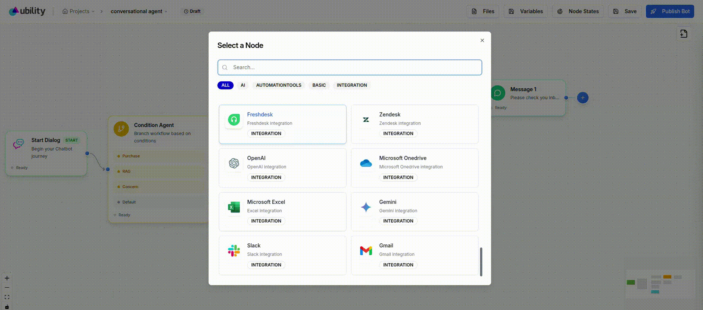
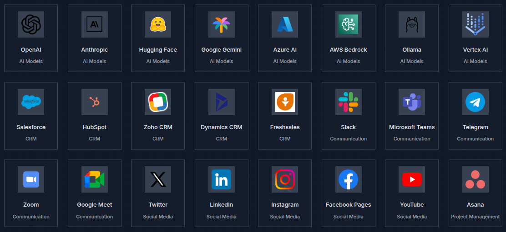

<p align="center">

</p>

# Move beyond workflows – An open source framework for building agents that talk to humans, not machines


**The open-source framework for human-centered agents**

 Most of today’s no-code agent builders are workflow-based. These platforms originate from automation tools like Zapier and n8n, which were designed to automate workloads triggered by machine events. In essence, they were made for machines talking to machines. Adapting that same workflow automation model to conversational AI agents doesn’t scale — it may work for a simple one-off conversational flow or a limited-scope agent, but building production-grade, human-facing agents such as full customer support or sales assistants quickly becomes a hassle.

 Human interaction is inherently dynamic. A conversation has state, context, and unpredictability. A user might start a purchase process, change their mind midway, and pivot to product recommendations or service inquiries — all within the same dialogue. Managing these fluid transitions requires more than static workflows; it demands context awareness, adaptability, and reasoning.

 Our product is an agentic framework built for developers who want to create agents that interact with humans, not machines. It provides robust primitives for state management, context tracking, and dynamic agent routing, allowing you to build adaptive, real-time conversational experiences. Instead of chaining rigid workflows, developers can design autonomous, stateful agents capable of reasoning, remembering, and adapting — enabling truly scalable human-centered automation.




---

## ⚡ Quick start

Download and Install [NodeJS](https://nodejs.org/en/download) >= 18.15.0  && [Python](https://www.python.org/downloads) >= 3.9.25

1. Try it instantly with npx:
    ```bash
    npx ubilityai
    ```

2. Or install it via npm
    ```bash
    npm install -g ubilityai
    ubilityai
    ```
 
4. 👉 Press "u" to open UI in your browser  Or Open [http://localhost:8031](http://localhost:8031)
---

## 🐳 Docker

1. Pull the image from [DockerHub](https://hub.docker.com):

    ```bash
    docker pull ubilityai/conversational-ai
    ```

2. Run image:

    ```bash
    docker run -d -p local-port:3000 --name container-name ubilityai/conversational-ai
    ```

3. Stop image:

    ```bash
    docker stop ubilityai/conversational-ai
    ```
---

## 🏅 Features

* Stateful agents with memory & context windows
* Dynamic agent routing (compose specialized agents and route at runtime)
* Built-in connectors: databases, vector stores, external APIs, and message channels
* Adapter system for custom  LLM providers, and tools
* Web UI for testing agents and visualizing conversation state
* Authentication + role-based access for multi-tenant deployments
* Extensible: add new integrations, actions, and agent types easily

### Integrate seamlessly with more than 500 app models and tools, extending your agents’ capabilities across CRMs, analytics platforms, support systems, and more.




---

## 🔐 Security

* Do not commit secrets to the repo.
* Use HTTPS and secure channels for webhooks.
* Rotate API keys and credentials regularly.
* Report security issues to the maintainers via a private channel.

---

## 📚 Support & Community

* Open an issue for bugs or feature requests.
* Join discussions in the repository.
* For commercial support, contact the maintainers [support@ubilityai.com](mailto:support@ubilityai.com).

---

## 📑 License

Information about the license model can be found in the `LICENSE.md`

---

## ✨ Attribution

Inspired by best practices from leading open-source projects and conversational platforms. Thanks to the open-source community for contributions and feedback.

